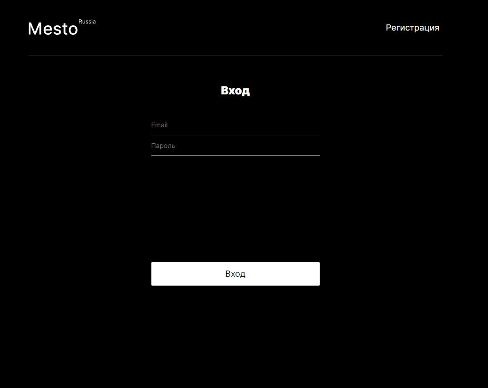
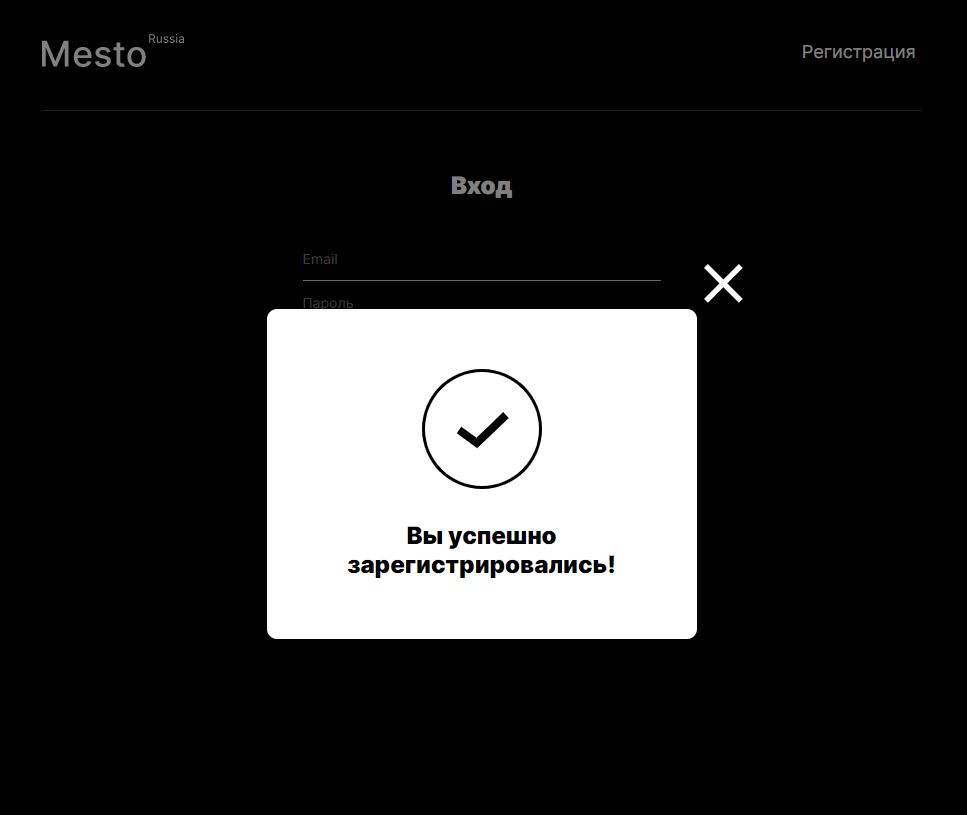
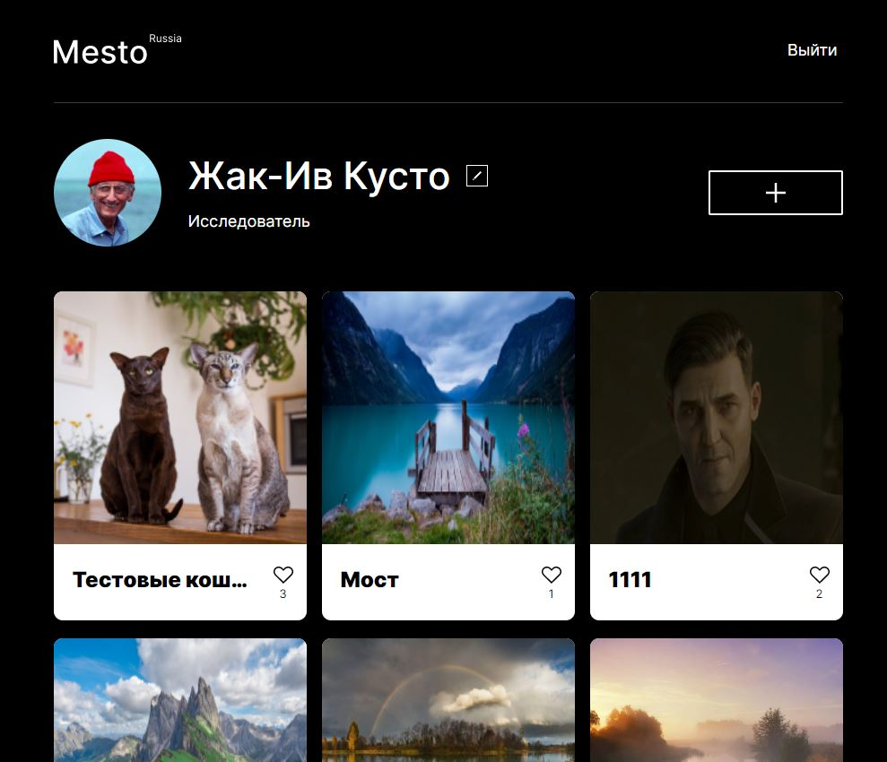
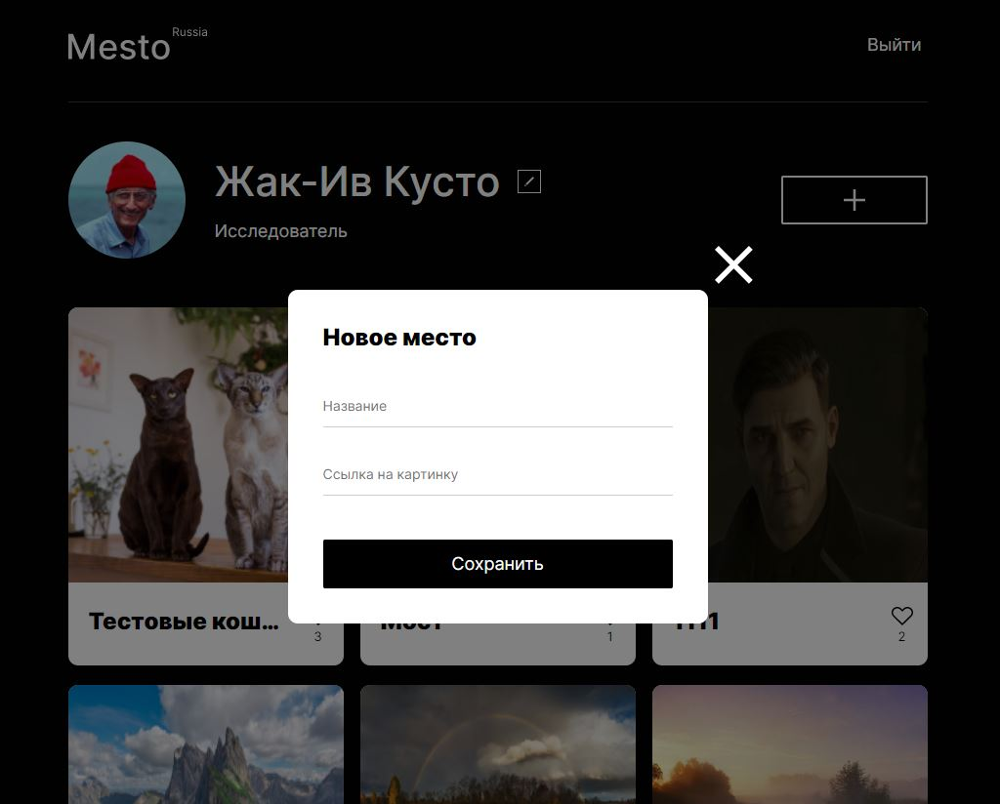
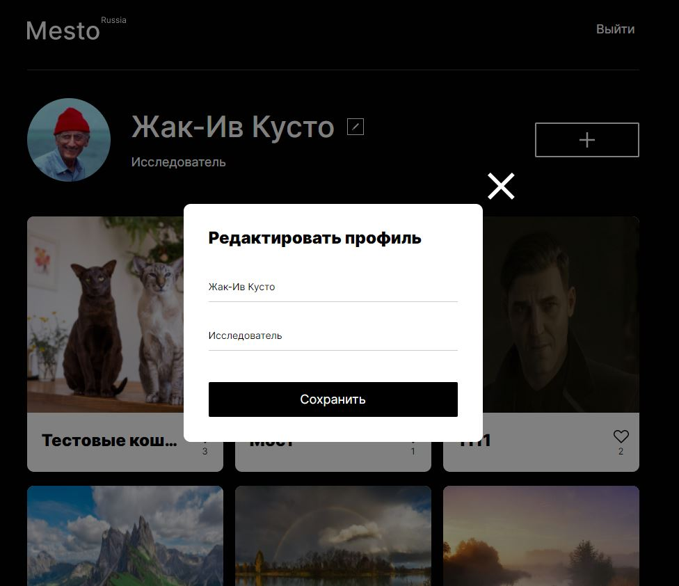

# react-mesto-api-full
Репозиторий для приложения проекта `Mesto`, включающий фронтенд и бэкенд части приложения со следующими возможностями: авторизации и регистрации пользователей, операции с карточками и пользователями. Бэкенд расположите в директории `backend/`, а фронтенд - в `frontend/`.

## Скриншоты:

### Логин и регистрация:

    
    

### Главная страница и открытая карточка:

    
    

### Модалки с редактированием профиля и добавлением новой карточки:

    
    

## Планируемые доработки:
- куки для хранения токенов вместо локального хранилища
- адаптив страниц логина и регистрации
- улучшение валидации данных в инпутах модальных окон

## Адрес сайта:
https://ihomeer-mesto.nomoredomains.rocks

## Публичный ip-адрес:
51.250.107.8
